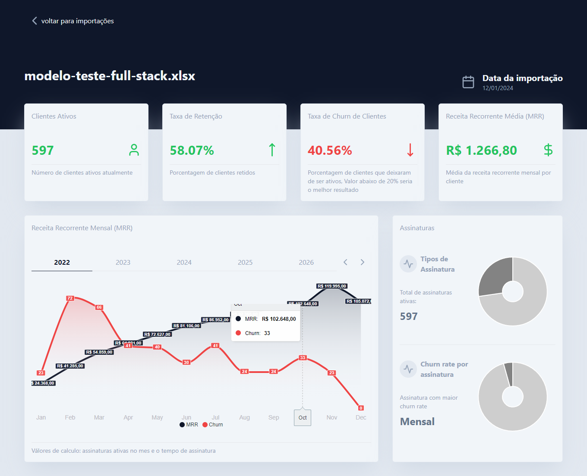
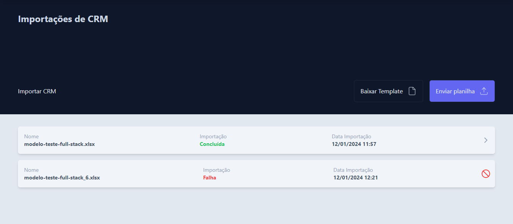
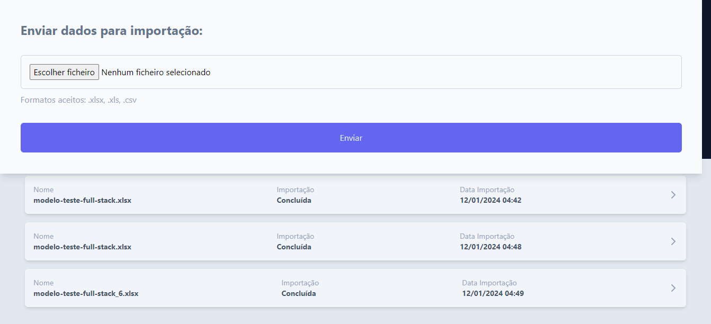
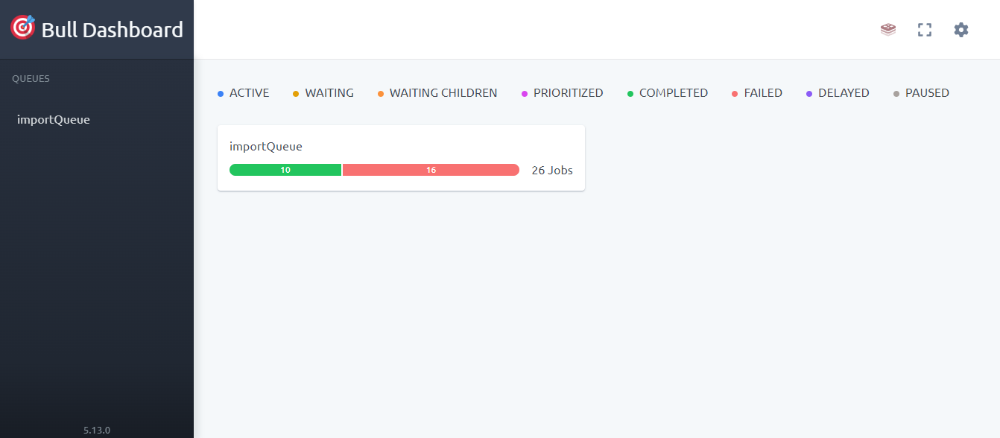

<h2 align="center">CRM Dashboard | Front end | Back end</h1>

  <p align="center" id="menu">
    <a href="#sobre-o-projeto">Sobre o projeto</a>
    <a href="#stacks-utilizadas">Stacks utilizadas</a>
    <a href="#instalação-e-execução-local">Instalação e execução local</a>
  </p>

  <h2 align="center" id="sobre-o-projeto">Sobre o projeto</h2>

<p align="center">
 Neste projeto, foi utilizado o Docker para simular ambientes de produção e desenvolvimento. Além disso, o Redis e o BullMQ estão sendo empregados para o processamento de dados de maneira assíncrona e paralela.
</p>

  <h2 align="center" id="stacks-utilizadas">Stacks utilizadas</h2>
<p align="center">
  <a href="https://skillicons.dev">
    
  </a>
</p>

  <h2 id="instalação-e-execução-local" align="center"> Instalação e execução local </h2>
  
  <p>
  Para executar esta aplicação, é necessário ter o Docker. Além disso, é necessário fazer o clone do repositório do projeto corretamente.

<b>Siga as instruções abaixo:</b>

<h1>Não esquecer o --recursive para clonar os submodulos</h1>

```
 git clone https://github.com/geniilsonfernandes/crm-dashboard.git --recursive
```

<h1>Execute o comando abaixo para iniciar o projeto com docker</h1>

```
cd crm-dashboard && docker-compose up
```

<p>
O aplicativo estará disponível em http://localhost:8080/
</p>

<h2 align="center" id="stacks-utilizadas">Configurando o insomnia</h2>
<b>Siga as instruções abaixo:</b>

<p> import o arquivo insomnia_api.yml no insomnia</p>

<h2 align="center" id="stacks-utilizadas">Imagems</h2>

 
 
 
 

<h2 align="center">Contato e redes sociais</h2>
<ul>
  <li>
    <a href="https://www.linkedin.com/in/genilson-fernandes">Linkedin</a>
  </li>
  <li>
    Email - geniilsonfernandes@gmail.com
  </li>
</ul>
```
